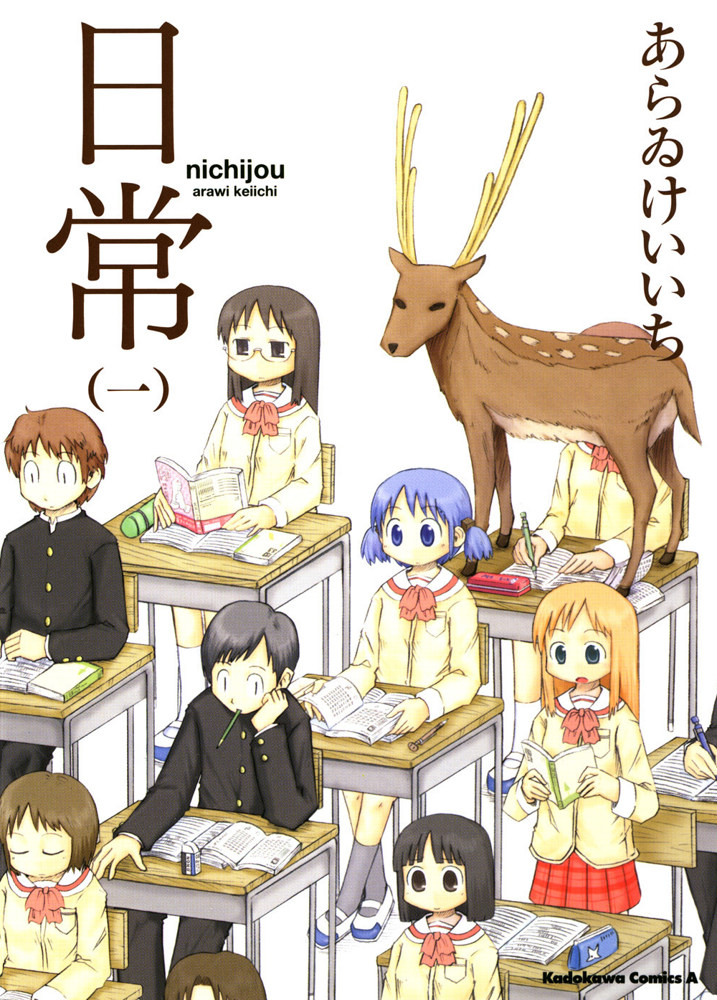
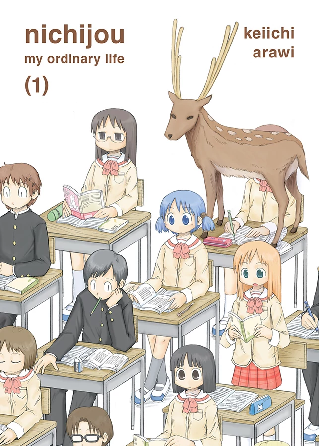

# nichijou (манга)

**nichijou (日常, «Повседневность», «Мелочи Жизни») —**
комедийная манга за авторством Кэйити Араи,
сочетающая в себе элементы стандартного стиля рисования и ёнкомы.

Выпускалась с декабря 2006 года до октября 2015 года
в ежемесячном журнале «Shonen Ace» издательства Kadokawa Shoten.
Также выходила в журнале «Comptiq» с марта по июль 2008 года.

Официально манга закончилась в декабре 2015 года
с выходом последнего 10 тома.

В 2011 году произведение получило аниме-экранизацию
под производством Kyoto Animation. 

###### Обложка первого тома nichijou

##Лицензирование манги компанией Vertical Comics
В июле 2015 года американская компания Vertical Comics Inc.
объявила о покупке лицензии на мангу.

В итоге вышли все 10 томов. Последний, 10-ый том
вышел 19-го сентября 2017 года.

Также в феврале 2017 года компания объявила
о лицензировании другой манги Кэйити Араи - Helvetica Standard.

Издание, в итоге, вышло 17 октября 2017 года.

Помимо американского издания, также существует
[официальное финское издание](http://animelehti.fi/arvostelut/anime/arki)
всех 10 томов.

######Обложка первого тома nichijou, изданного Vertical Inc.

##6-е место на Sugoi Japan Award 2015
В декабре 2015 года манга заняла 6-е место на
[всенародном голосовании Sugoi Japan Award](http://www.crunchyroll.com/anime-news/2015/03/12/sugoi-japan-announces-list-of-anime-manga-and-light-novel-everyone-should-try)
в котором определялись списки лучших произведений аниме, манга и ранобэ.

## Где почитать?

* [MangaHub](https://mangahub.ru/nichijou_my_ordinary_life)

* [Манга-тян](http://mangachan.me/manga/14968-everyday-life.html)

* [ReadManga](http://readmanga.me/everyday_life)

## Где купить?
### Оригинальная японская манга

* [CDJapan](http://www.cdjapan.co.jp/searches?term.media_format=&f=major&q=%E6%97%A5%E5%B8%B8&f=artist&q=Keiichi+Arai&f=major&q=&order=scoreboost_cdj&range.rel=&range.sale_price=&term.caption=&term.audio_language=)

* [Amazon.com](https://www.amazon.com/gp/bookseries/B00R620MEE/ref=dp_st_4041033357)

### Официальное американское издание

* [Amazon.com](https://www.amazon.com/gp/bookseries/B01AJ2EFIQ/ref=dp_st_1942993692)
